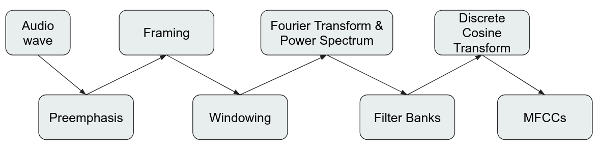
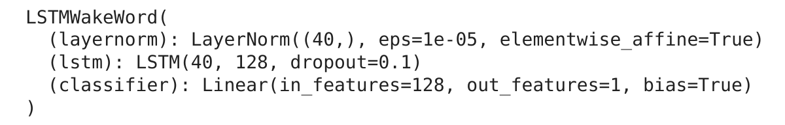
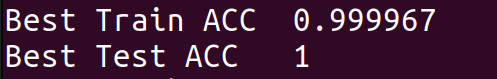
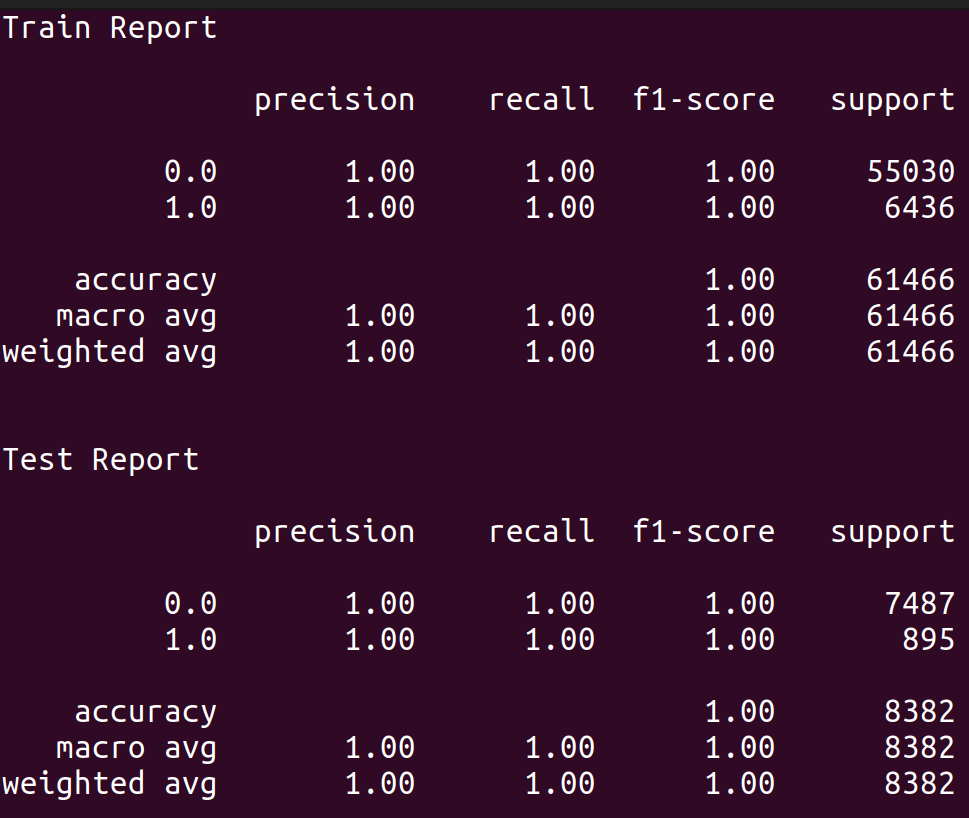

# Build a Wake Word Detection model for Voice Assistant
This is a Wake Word Detection model for Voice Assistant, which can detect/recognize user's voice (after trained), wake and response to user whenever a wake word from user's speech is detected.

***Wake Word: the word/command that used for wake the voice assistant up, ex: Hey Siri, Hey Google,...

Objective: Build a Wake Word Detection model for Voice Assistant just by PyTorch, no API. The model will be a binary classification RNN (LSTM variant) and must be light weight so that it can be used on small machine (like raspberry pi or personal laptop)
## To Do:
* Collect data in the form of .wav files, environment sounds or random speech will be zero labeled data, user's voice saying the wake word will be one labeled data.
* Use the MFFCs technique to process the data.
* Build a binary classification RNN (LSTM variant) model.
* Split collected data into train set and test set, then processing them before puting them to training phase along with the model.
* Train and optimize the model, testing with demo script.
* Try to put the model into raspberry pi
## Data Processing Technique
### Mel Frequency Cepstral Coefficients (MFCCs)
In sound processing, the mel-frequency cepstrum (MFC) is a representation of the short-term power spectrum of a sound, based on a linear cosine transform of a log power spectrum on a nonlinear mel scale of frequency.

Mel-frequency cepstral coefficients (MFCCs) are coefficients that collectively make up an MFC. They are derived from a type of cepstral representation of the audio clip (a nonlinear "spectrum-of-a-spectrum"). The difference between the cepstrum and the mel-frequency cepstrum is that in the MFC, the frequency bands are equally spaced on the mel scale, which approximates the human auditory system's response more closely than the linearly-spaced frequency bands used in the normal spectrum. This frequency warping can allow for better representation of sound, for example, in audio compression that might potentially reduce the transmission bandwidth and the storage requirements of audio signals.

MFCCs are commonly derived as follows:

* Take the Fourier transform of (a windowed excerpt of) a signal.
* Map the powers of the spectrum obtained above onto the mel scale, using triangular overlapping windows or alternatively, cosine overlapping windows.
* Take the logs of the powers at each of the mel frequencies.
* Take the discrete cosine transform of the list of mel log powers, as if it were a signal.
* The MFCCs are the amplitudes of the resulting spectrum.



For more infomation:
[https://en.wikipedia.org/wiki/Mel-frequency_cepstrum](https://en.wikipedia.org/wiki/Mel-frequency_cepstrum)
[https://www.analyticsvidhya.com/blog/2021/06/mfcc-technique-for-speech-recognition/](https://www.analyticsvidhya.com/blog/2021/06/mfcc-technique-for-speech-recognition/)

## Model Structure
### Layer Normalization

### LSTM

### Linear Classifier



With the above configuration, the model contains 87249 parameters.

## Running Result
### Train & Test
** After multiple times of training, I found that the best result can be obtained by distributing the data to 90/10 (90% for non-wake word, 10% for wake word).

For one labeled file, I recorded about 100 times of my own voice saying the wake word "Hey Eva" (2 seconds each), then replicated them by 70 times. For zero label, I recorded the surrounding sound, random speech from me and other people, split them in to files with 2 seconds lenght. Finally trained for 50 epochs with over 62.000 zero labeled and 7.000 one labeled audio files. I got these results:
* Best test accuracy:


* Classification Report:


### Demo Result
After running engine.py with optimized model, I saw that the model worked well, it could easily recognize my voice saying the wake word and response back, but it not perfect, there are some pros and cons of the model:

Pros:

* Light weight
* Good sensitivity
* Short training time
* Can easily train on CPU or Colab

Cons:

* The model is hard to work in a noisy environment
* The voice assistant could wake up with user's random speech/non-wake word (rarely occur)  
* If user said something similiar to the wake word, the voice assistant could also detect it as the wake word (ex: my wake word is "hey Eva", saying "hey Sheva" or even just "Eva" will also wake the assistant up)

## To run this project:
### Running on native machine
#### Dependencies
* python3
* portaudio (for recording with pyaudio to work)
* using a linux/mac machine or wsl2 on windows (because torchaudio may not work on windows)
#### pip packages
`pip install -r requirements.txt` 

### Running with Docker
#### setup
If you are running with just the cpu
`docker build -f cpu.Dockerfile -t voiceassistant .`

If you are running on a cuda enabled machine 
`docker build -f Dockerfile -t voiceassistant .`

## Wake word detection

### scripts
For more details make sure to visit these files to look at script arguments and description

`wakeword/neuralnet/train.py` is used to train the model

`wakeword/neuralnet/optimize_graph.py` is used to create a production ready graph that can be used in `engine.py`

`wakeword/engine.py` is used to demo the wakeword model

`wakeword/scripts/collect_wakeword_audio.py` - used to collect wakeword and environment data

`wakeword/scripts/split_audio_into_chunks.py` - used to split audio into n second chunks

`wakeword/scripts/split_commonvoice.py` - if you download the common voice dataset, use this script to split it into n second chunks

`wakeword/scripts/create_wakeword_jsons.py` - used to create the wakeword json for training

### Steps to train and demo your wakeword model

For more details make sure to visit these files to look at script arguments and description

1. collect data
    1. environment and wakeword data can be collected using `python collect_wakeword_audio.py`
       ```
       cd VoiceAssistant/wakeword/scripts
       mkdir data
       cd data
       mkdir 0 1 wakewords environment
       
       python collect_wakeword_audio.py --sample_rate 8000 --seconds 2 --interactive --interactive_save_path ./data/wakewords

       python collect_wakeword_audio.py --sample_rate 8000 --save_path ./data/environment/env.wav

       ```
    2. to avoid the imbalanced dataset problem, we can duplicate the wakeword clips with 
       ```
       python replicate_audios.py --wakewords_dir data/wakewords/ --copy_destination data/1/ --copy_number 50
       ```
    3. be sure to collect other speech data like random speech or [common voice dataset](https://commonvoice.mozilla.org/en/datasets). split the data into n seconds chunk with `split_audio_into_chunks.py`.
    4. put data into two seperate directory named `0` and `1`. `0` for non wakeword, `1` for wakeword. use `create_wakeword_jsons.py` to create train and test json
    5. create a train and test json in this format...
        ```
        // make each sample is on a seperate line
        {"key": "/path/to/audio/sample.wav, "label": 0}
        {"key": "/path/to/audio/sample.wav, "label": 1}
        ```

2. train model
    1. use `train.py` to train model (--no_cuda for training on just cpu)
        ```
        python train.py --save_checkpoint_path checkpoint/ --train_data_json data_json/train.json --test_data_json data_json/test.json --no_cuda
        ```

    2. after model training use `optimize_graph.py` to create an optimized pytorch model

3. test
    1. test using the `engine.py` script
    
NOTE: the test response will just randomly play audio file in demo_voice/terminator (Terminator's voice), which was downloaded from https://www.soundboard.com/sb/Pappa

*** The code was modified from a part of [Michael Nguyen's AI Voice Assistant](https://github.com/LearnedVector/A-Hackers-AI-Voice-Assistant), license included.
